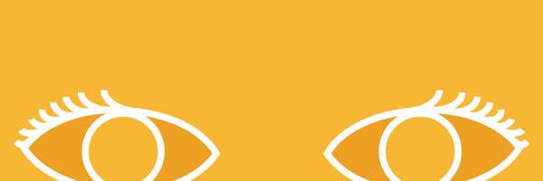

# My First Coding Assignment

## About Me
I am a Graphic designer and multimedia producer based in Rome, Italy. I am passionate about all-things-visual. 
## Past Coding Experience
I have no coding experience except for practicing a bit of html through an app called Mimo
## Career Goals
1. Become an expert in creative interactive communication products
2. Manage a small team of creatives from different backgrounds to build innovative Experiences
3. Create engaging experiences, branding and digital storytelling for renowned brands or institutions
4. Create interactive products to raise awareness on Global issues and humanitarian causes